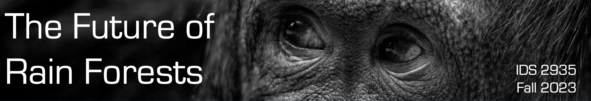
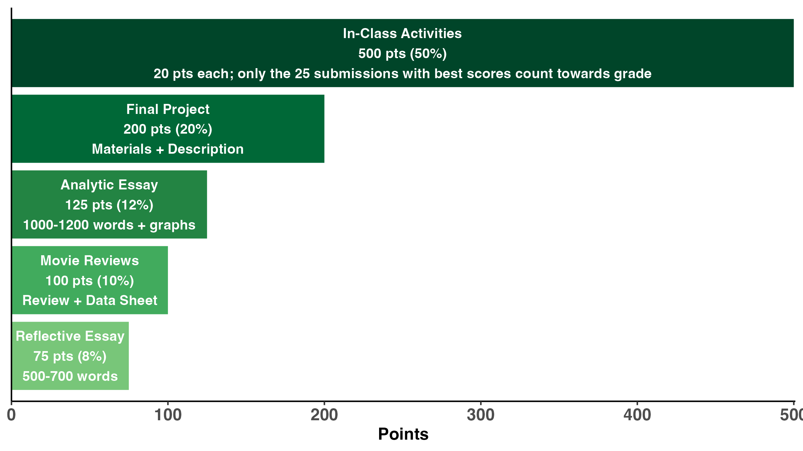
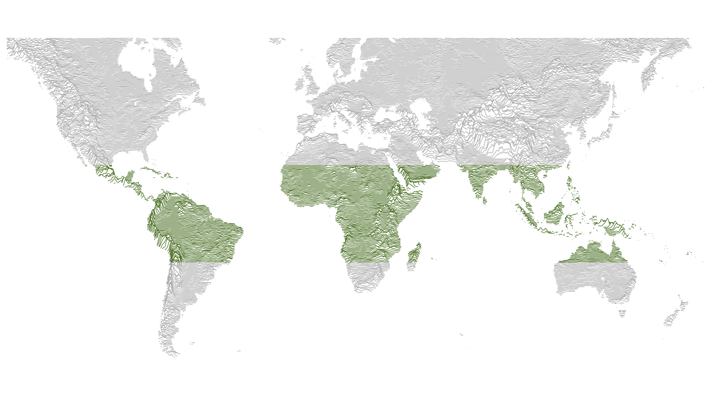

```{r setup_syllabus, include=FALSE}
knitr::opts_chunk$set(echo = TRUE)
library(tidyverse)
library(kableExtra)
library(tidyverse)
library(RColorBrewer)
library(viridis)   
```

```{r banner, echo=FALSE, include=TRUE, out.width = '100%', fig.align="center"}

```


\vspace{-0.5cm}

# Course Overview

### Course Sessions {.unnumbered}

**When:** Tuesdays 3:00-3:50 and Thursdays 3:00-4:55  
**Where:** LIT 0231 (both days)  

### Instructor and TA {.unnumbered}

**Instructor:** Dr. Emilio M. Bruna  
email: embruna@ufl.edu  
phone: (352) 846-0634  
Office: Tropical Ecology & Conservation Lab, 711 Newell Dr.  

**TA:** Priyanka Hari Haran  
email: phariharan1@ufl.edu   
Phone: (352) 846-0527  
Office: Tropical Ecology & Conservation Lab, 711 Newell Dr.  

\vspace{0.3cm}
### Course Description & Objectives {.unnumbered}

This course investigates the fundamental issues addressed by scientists studying tropical rain forests, including what gave rise to their remarkable biodiversity, the drivers and consequences of deforestation, why people are fascinated by rain forests, cultural stereotypes about the tropics, and if forest conservation is compatible with socioeconomic development. ***By the end of the course students will be able to:***

-   Recognize and describe stereotypes about rain forests & their residents
-   Analyze rain forest tropes in art, literature, & popular culture
-   Discuss & evaluate hypotheses for the origins and maintenance of tropical biodiversity
-   Explain & compare human history in rain forests
-   Review contemporary threats to rain forests
-   Analyze and visualize data on deforestation
-   Review and contrast strategies for rain forest conservation & restoration
-   Identify rain forests in their daily lives & set personal goals for advancing their conservation
-   Produce materials for communicating about rain forests to family and peers

### GenEd and Quest Information {.unnumbered}

<!-- \vspace{0.3cm} -->

**A minimum grade of C is required for Quest and General Education credit.** Courses intended to satisfy Quest and General Education requirements cannot be taken S-U. *This course fulfills the following Quest and GenEd requirements:*

-   Quest 2 <!-- -   GenEd Biological Sciences -->
-   GenEd International
-   *Credits:* 3
-   *Prerequisites:* None

\vspace{0.2cm}

**This also counts towards a minor or certificate in Latin American Studies.**\
See [www.latam.ufl.edu/academics/undergraduate-programs](https://www.latam.ufl.edu/academics/undergraduate-programs/) for more information. <!-- , fig.margin=TRUE-->

### Required Course Materials & Supplies Fees {.unnumbered}

**Students are not required to purchase any textbooks or course materials;** all materials, including readings and videos, will be available on the course Canvas page. However, many of the assigned readings from the *New York Times* and *Washington Post* have dynamic multimedia data visualizations and video that can't be appreciated in the posted .pdf format. *Students in this class should sign up for free online access to the New York Times* and *Washington Post* by following the instructions at [this UF Libraries Website](https://businesslibrary.uflib.ufl.edu/c.php?g=943928&p=7708734).

**Materials and Supplies Fees**: None.

\newpage

### Office Hours {.unnumbered}

<!-- \vspace{-0.3cm} -->

**Instructor:** Wednesday & Friday 1:30-3:00 pm or by appointment (in-person & online). Drop by anytime or sign up for a specific time here: <https://embruna.youcanbook.me>.

**Teaching Assistant:** Tuesday 1:00-2:30 pm or by appointment (in-person & online).

***Location: In-person:*** The Tropical Ecology & Conservation Lab is located next to the Rawlings Hall bus stop (711 Newell Drive; to find a map click the "Contact" link at [BrunaLab.org](http://brunalab.org)). ***Location - online:*** use the zoom link on the course Canvas page. We are online the entire session.


------------------------------------------------------------------------

\vspace{-0.7cm}

------------------------------------------------------------------------


```{r banner1, echo=FALSE,message = FALSE,warning=FALSE, out.width = '15%',fig.align="center" }

```

#  Assignments, Grades, & Attendance

------------------------------------------------------------------------

\vspace{0.3cm}

Learning in our class is achieved with an diverse array of methods ranging from data analysis to essays to projects. In most class sessions you will also be working with small groups of students to complete an in-class assignment that reinforces the major themes of the day's topic. In keeping with the philosophy of the Quest program, this course also has *Experiential Learning and Self-Reflection Components*. For details on the different types of assignments and the Quest Learning Components, see course Canvas page.


\vspace{0.1cm}


### Assignments (1000 points total) {.unnumbered}

\vspace{-0.5cm}

```{r graph2, echo=FALSE,message = FALSE,warning=FALSE, out.width = '85%',fig.align="center" }


```


### Grading {.unnumbered}

**In-class Assignments are due by the following class session.** Late assignments will lose 10 pts.

***Regrades:*** Requests for re-evaluation of assignments must be accompanied by an explanation for why you think you deserve additional credit and the number of additional points you think you deserve. The deadline for submission is one week after the work was returned.

***Grade Assignment*** (based on % of total points earned): A = 94--100%, A- = 90--93%, B+ = 87--89%, B = 84--86%, B- = 80--83%, C+ = 77--79%, C = 74--76%, C- = 70--73%, D+ = 67--69%, D = 64--66%, D- = 60--63%, E\<60

<!-- >A grades: A = 94--100%, A- = 90--93%   -->

<!-- >B grades: B+ = 87--89%, B = 84--86%, B- = 80--83%    -->

<!-- >C grades: C+ = 77--79%, C = 74--76%, C- = 70--73%   -->

<!-- >D & E grades: D+ = 67--69%, D = 64--66%, D- = 60--63%, E < 60 -->

<!-- \vspace{0.3cm} -->

***Grade Points:*** For information on how UF assigns grade points, visit: \newline \<<https://catalog.ufl.edu/UGRD/academic-regulations/grades-grading-policies/>

<!-- ```{r chainsaw, echo=FALSE, include=TRUE,fig.cap="", out.width = '3%', fig.align="left" } -->

<!--  -->

<!-- #  -->

<!-- ``` -->

<!-- ```{r attendance, echo=FALSE, include=TRUE,fig.cap="Attendance and Participation", out.width = '3%', fig.align="left" } -->
<!--  -->
<!-- #  -->
<!-- ``` -->

\vspace{-0.3cm}

### Attendance & Participation {.unnumbered}

<!-- \vspace{0.3cm} -->

***Attendance:*** Though attendance is not required, many of the sessions we will be completing activities in class that count towards your grade. Most of these can be completed independently, but by doing them in class you will benefit from working collaboratively with the other students.

*Some of the in-class activities can not be completed outside of class time.* If you miss class on one one of these days, that is why the grade for in-class activities is based on a subset of the total activities; you can also elect to make up lost points with extra-credit assignments. *If you need to miss class for any reason, please let me know as soon as possible*. We will make arrangements for you to complete any assignments and go over any material you will be missing. I would much rather you focus on your health, attend your conference, or support friends and family in need than struggle to turn in assignments.

***Participation:*** Consistent informed, thoughtful, and considerate class participation is encouraged (and in some cases required). *If you have personal issues that prohibit you from joining freely in class discussion (e.g., shyness, language barriers, medical condition): no problem.* let us know and we will discuss alternative modes of participation.

***Important note regarding class discussions and group work:*** We will explore some challenging, important problems and increase our understandings of different perspectives and approaches for addressing them. These conversations may not always be easy; we sometimes will make mistakes in both how we communicate our perspective and what we hear other say. There may be times when we need patience, courage, imagination, and of course mutual respect to engage our texts, classmates, instructors, guests, and our own ideas and experiences. *Disrespectful or disruptive behavior will not be tolerated*. And always remember that as scholars we must employ critical thinking, rely on data, and cite verifiable sources and experts to interrogate all assigned readings and subject matter in this course as a means of determining if we agree with classmates and instructors. No lesson is intended to espouse, promote, advance, inculcate, or compel a particular feeling, perception, viewpoint or belief.

<!-- ```{r ridges_image, echo=FALSE, include=TRUE, out.width = '90%', fig.align="center" } -->
<!--  -->
<!-- #  -->
<!-- ``` -->


------

```{r attendance, echo=FALSE, include=TRUE,fig.cap="", out.width = '15%', fig.align="center" }

# 
```  

# Semester Calendar & Key Dates  


----

\vspace{0.0cm}

<!-- \captionsetup[table]{labelformat=empty} -->

<!-- ```{=tex} -->

<!-- \definecolor{darkmidnightblue}{HTML}{003366} -->

<!-- \captionsetup{labelformat=empty,font={color=darkmidnightblue,bf,large}} -->

<!-- ``` -->

```{r course_calendar, echo=FALSE,message = FALSE,warning=FALSE}
calendar <- read_csv("./schedule_original.csv") %>% 
    mutate(WEEK=paste(Week1,WEEK,sep=" ")) %>% 
  select(-X1,-Week1) %>% 
  mutate(DATE=paste(Day,Month,sep="-")) %>% 
  mutate(SESSION=as.character(SESSION)) %>% 
  select(WEEK,SESSION,DATE,TOPIC, `ASSIGNMENT INFO`=`ASSIGNMENT DISTRIBUTED or DUE`) %>% 
  replace_na(list(DATE="",WEEK="",SESSION="", TOPIC="", `ASSIGNMENT INFO`="")) %>% 
  rename(" "="SESSION") 
  

calendar$WEEK <- gsub("NA NA","", calendar$WEEK)
calendar$DATE <- gsub("NA-NA","", calendar$DATE)
calendar$WEEK <- gsub("NA Final Exam","", calendar$WEEK)
calendar$WEEK <- gsub("Finals Week NA","Finals Week", calendar$WEEK)
# names(calendar) <- c("","","")

kable(calendar,
      # digits = 2,
      align="ccclr",
      # format="latex",
      format="html",
      row.names = FALSE,
      escape= TRUE,
      booktabs=T,
      linesep = "",
      # caption = "Semester Overview and Key Dates"
      ) %>% 
    # kable_styling(font_size = 50) %>%
    gsub("font-size: initial !important;", 
         "font-size: 50pt !important;", 
         .) %>% 
   # kable_styling(latex_options = "HOLD_position") %>% 
   kable_classic_2(full_width = F,
                # latex_options="scale_down",
                font_size = 14,
                position = "left") %>%
  # column_spec(1, bold = F, border_right = T) %>%
  # column_spec(2, width = "5em", background = "white",border_right = T) %>% 
  pack_rows("WHY ARE WE FASCINATED BY TROPICAL RAIN FORESTS?", 1, 7) %>%
  pack_rows("THE ECOLOGY & EVOLUTION OF TROPICAL RAIN FORESTS", 8, 22) %>%
  pack_rows("THE DRIVERS AND IMPACTS OF DEFORESTATION", 23, 30) %>%
  pack_rows("THE FUTURE OF TROPICAL RAIN FORESTS", 31, 48) %>%
  # pack_rows("Finals Week", 49, 49) %>%
  kable_styling(
    bootstrap_options = c("hover"),
                full_width = T,
                # latex_options= c("scale_down","HOLD_position"),
                font_size = 18,
                position = "left") %>% 
  column_spec(1, width = "7em") %>%
  column_spec(2, width = "1em") %>%
  column_spec(3, width = "8em") %>%
  column_spec(4, width = "36em") %>% 
  column_spec(5, width = "18em") %>% 
  column_spec(5, bold=T) %>% 
  row_spec(0, bold=T) %>% 
  row_spec(49, bold=T) %>% 
  row_spec(0, bold = T, color = "white", background = "darkgray") 
# %>% 
#   add_header_above(c("Semester Overview & Key Dates" = 5), bold=T,color= '#003366')

# column_spec(3, width = "15em") %>%
# column_spec(4, width = "3em") %>%
# row_spec(0,hline_after = F, bold=T) %>%
# row_spec(c(1:2),hline_after = T)

```


